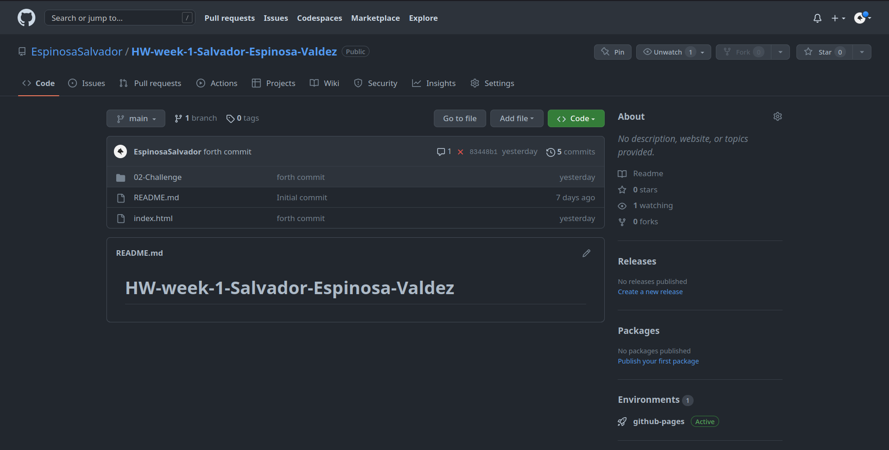
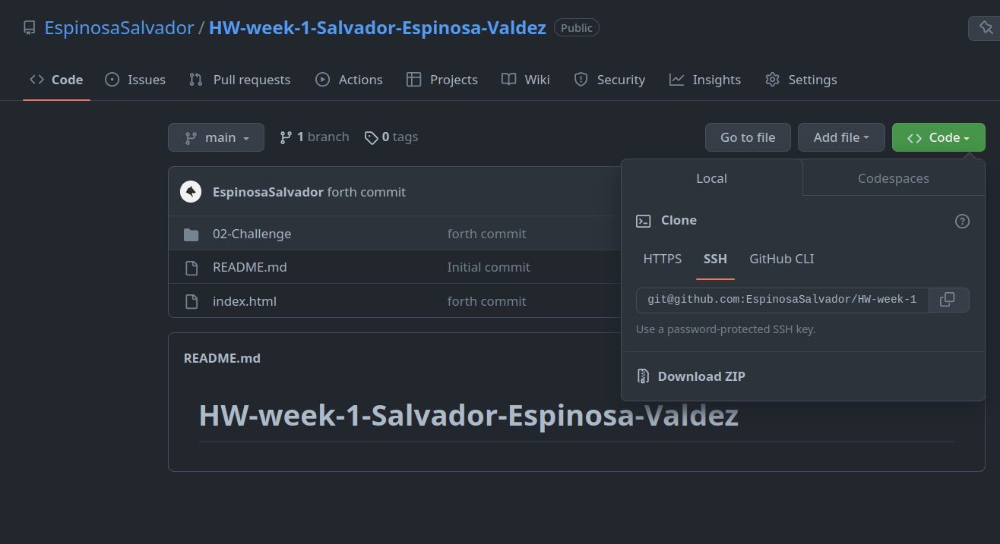

# Horiseon

## Table of Content

* [Introduction](#introduction)
* [Requirements](#requirements)
* [Installation](#installation)
* [Configuration](#configuration)
* [Troubleshooting](#troubleshooting)
* [FAQ (Frecuently Asked Questions)](#faq-frecuentrly-asked-questions)
* [Team](#team)

## Introduction

This project was requested by our customer Horiseon, they stated that they wanted a Refactoring. *(Improving existing code without changing what it does, to meet a certain set of standards)*

## Requirements

the requirements to run this webpage are really low due that we are only using *HTML* and *CSS*.

* Vs code
* GitHub
* Internet

## Installation

To install this project please proceed to our [GitHub Repository](https://github.com/EspinosaSalvador/HW-week-1-Salvador-Espinosa-Valdez)

you should be able to see this,



Click on code as shown in the image



Copy the SSH key or the HTTPS key and open.

* Terminal
* Git bash
* CMD

either one of this will work. please proceed to the terminal an put in your Terminal,

```
git clone git@github.com:EspinosaSalvador/HW-week-1-Salvador-Espinosa-Valdez.git
```
and now you have a copy of the code.

## Configuration

If you want to do any configurations on this project please open a new branch you can do this by putting the following code in your terminal,

```
git checkout -b ＜new-branch＞
```
switch branches putting the following code on your terminal.

```
git checkout ＜branchname＞
```
If you want to show us your code and merge please open a pull request on [Github](https://github.com/EspinosaSalvador/HW-week-1-Salvador-Espinosa-Valdez/pulls).

## Troubleshooting

The webpage is running in company standards, please let us know if there is anybug in the webpage by issuing a in [Github](https://github.com/EspinosaSalvador/HW-week-1-Salvador-Espinosa-Valdez/issues)

## FAQ (Frecuentrly Asked Questions)

We will update this part when we have some frequently asked question.

## Team

* Horiseon Team
* Salvador Espinosa Valdez